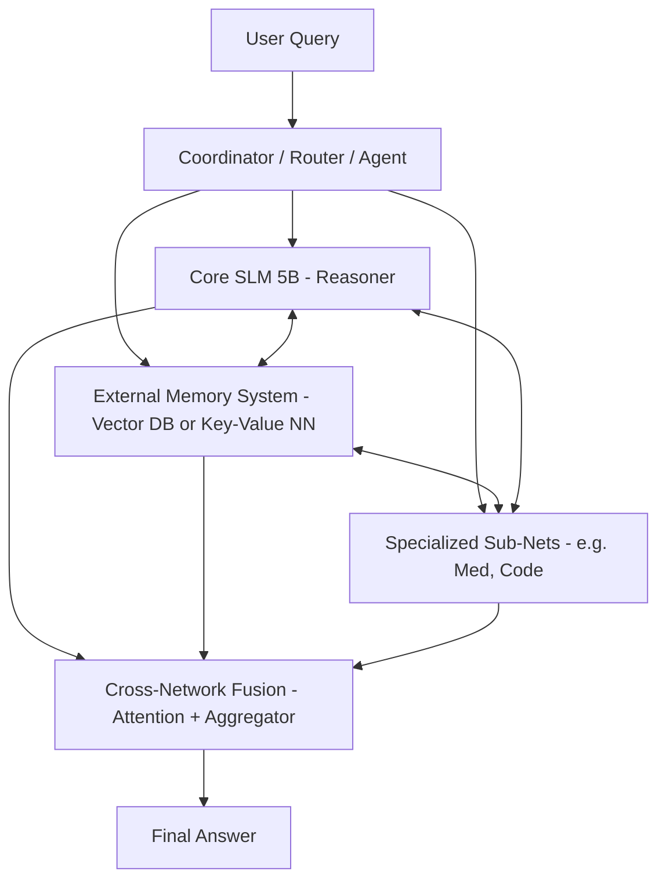

```mermaid
flowchart TD

    %% Nodes
    A[User Query]
    B[Coordinator / Router / Agent]
    C[Core SLM 5B - Reasoner]
    D[External Memory System - Vector DB or Key-Value NN]
    E[Specialized Sub-Nets - e.g. Med, Code]
    F[Cross-Network Fusion - Attention + Aggregator]
    G[Final Answer]

    %% Edges
    A --> B
    B --> C
    B --> D
    B --> E

    C <--> D
    D <--> E
    E <--> C

    C --> F
    D --> F
    E --> F

    F --> G
```
