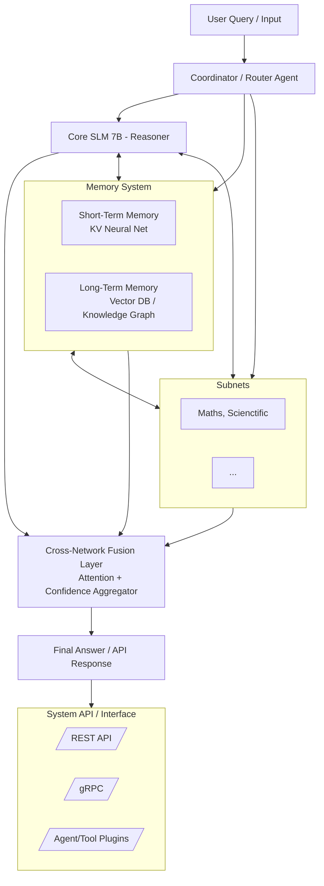

```mermaid
flowchart TB

    %% User Interaction
    A[User Query / Input] --> B[Coordinator / Router Agent]

    %% Core Model
    B --> C[Core SLM 7B - Reasoner]

    %% Memory System
    subgraph D[Memory System]
        D1[Short-Term Memory
            KV Neural Net]
        D2[Long-Term Memory
            Vector DB / Knowledge Graph]
    end
    B --> D
    C <--> D

    %% Specialized Subnets
    subgraph E[Subnets]
        E1[Maths, Scienctific]
        E2[...]
    end
    B --> E
    C <--> E
    D <--> E

    %% Fusion Layer
    F[Cross-Network Fusion Layer
        Attention + Confidence Aggregator]
    C --> F
    D --> F
    E --> F

    %% Final Output
    F --> G[Final Answer / API Response]

    %% API Layer
    subgraph H[System API / Interface]
        H1[/REST API/]
        H2[/gRPC/]
        H3[/Agent/Tool Plugins/]
    end
    G --> H
```
